# TNSR Postman Collections

This public repo contains a Postman enviroment and Postman collection that can be used to interact with TNSR. TNSR is a high-performance software router based on FD.io's Vector Packet Processing (VPP). TNSR software combines VPP with Data Plane Developement Kit (DPDK) and other open-source technologies to provide a high-performace router which enables businesses and service providers to address today's edge and cloud networking needs.

You can edit the variables in the enviroment to point to your own TNSR device. Feel free to modify them as you see fit and add more calls to the collection.

## Setup

Setup TNSR before the Postman setup:
minimum required TNSR version release 23.06

```

    pki generate-restconf-certs length 4096
    restconf
        enable true
        global authentication-type user
        global server-certificate restconf
        global server-key restconf
        server host 0.0.0.0 443 true
    exit

```

The configuration example above is using Basic Authentication. TNSR also has cert-based authentication which is more secure and can be set up in Postman (out of scope of this document). For more details please refer to this [documentation](https://docs.netgate.com/tnsr/en/latest/recipes/restconf-pki-nacm/index.html). 

<hr/>

Follow these steps to setup Postman:

1. Download and install the desktop app at [Download Postman | Get Started for Free](https://www.postman.com/downloads/). Create a free Postman account to use the app.

2. Clone a TNSR Postman Collections repository and download TNSR collections.postman_collection.json and TNSR-enviroment.postman_environment.json files. 

3. Import TNSR collections.postman_collection.json and TNSR-enviroment.postman_environment.json to “My Workspace” in Postman. “My Workspace” can be accessed from Workspaces → My Workspace in the header.

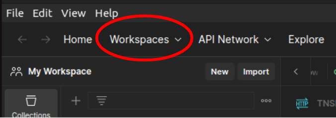

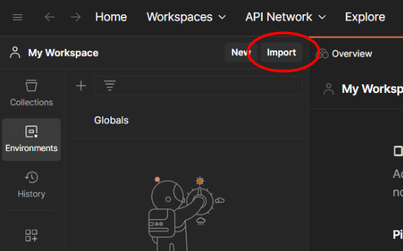

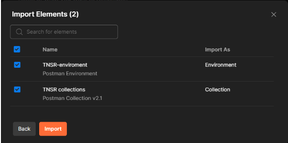

4. A list of collections and a TNSR-environment can be accessed using the Collections and Environments sidebar elements.

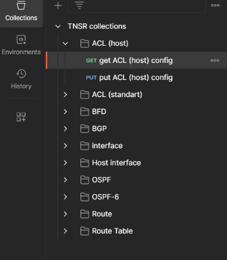

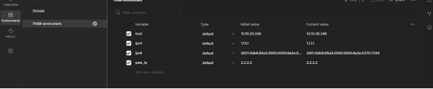

5. Before sending the requests, change No Environment to TNSR-Environment to access and edit the variables. A Postman environment is a set of variables you can use in your Postman requests. 

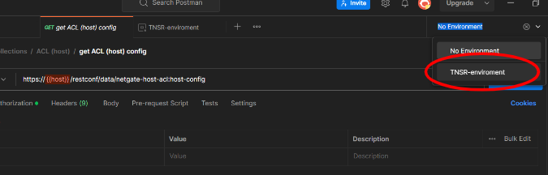

6. Change the initial and current IP address of a {{host}} to an IP address of the host management IP address of the TNSR installation by going to Environments sidebar element → TNSR-environment and changing the values in the entry fields 

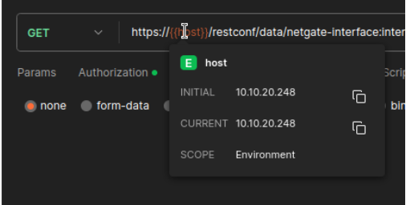

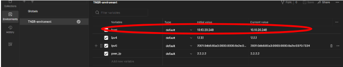

Variable descriptions and uses:

host - contains the IP address of TNSR installation, used in the URL fields

ipv4 - contains IPv4 address of TNSR installation, used in the body of PUT requests

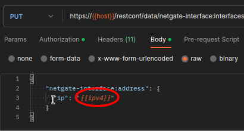

ipv6 - contains IPv6 address of TNSR installation, used in the body of PUT requests

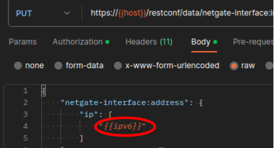

peer_ip - contains the IP address of the peer, used in the body of PUT requests

7. Make sure the local SSL certificate verification is turned off because the server certificate is self signed.

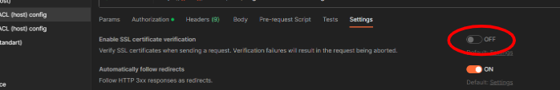

8. Make sure you are using Basic Authentication by going to Collections → TNSR collections → choosing a request you are planning to send and clicking on authorization tab

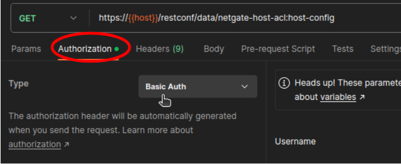

9. To send a request press the send buttonsimply

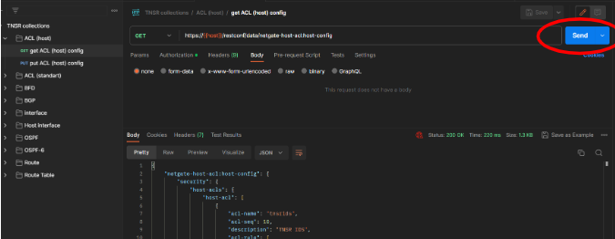

Examples:

GET request - press the Send button and receive the output body 

PUT request - edit the input body and press the Send button to make a change
